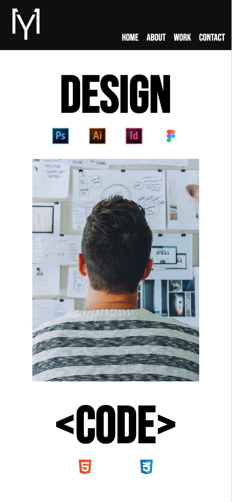

# Markussyev Portfolio

This project represents my portfolio as a graphic designer and front-end developer, showcasing my skills and expertise in both design and web development.

## Built with

- **Html** 
- **Css**
- **Visual Studio Code**
- **Figma**

## Discover the Project
For my portfolio project, I utilized *HTML* and *CSS*, crafting the code in *Visual Studio Code*. Leveraging the design capabilities of *Figma*, I meticulously crafted the visual elements. This endeavor provided me with the opportunity to refine my skills as a graphic designer and front-end developer, seamlessly blending creativity with technical proficiency. Through meticulous coding and design, I aimed to create a visually captivating and functionally robust representation of my work and capabilities.

The page is designed as a single-scrolling website consisting of four sections: Home, About, Work, and Contact. Additionally, the project encompasses responsive design, allowing seamless viewing on both desktop and mobile platforms.

### Destop version 

### Mobile version 

 
 ## Purpose Behind Creation

This website, my portfolio, is intended for potential clients, employers, and industry colleagues to provide them with insight into my skills and previous work as a graphic designer and front-end developer.

## Evolution and Future Enhancements

This marks the debut edition of the project, with ongoing plans for refinement and enhancement. New features and functionalities will be incorporated into the project as it evolves, ensuring its continuous improvement and relevance.